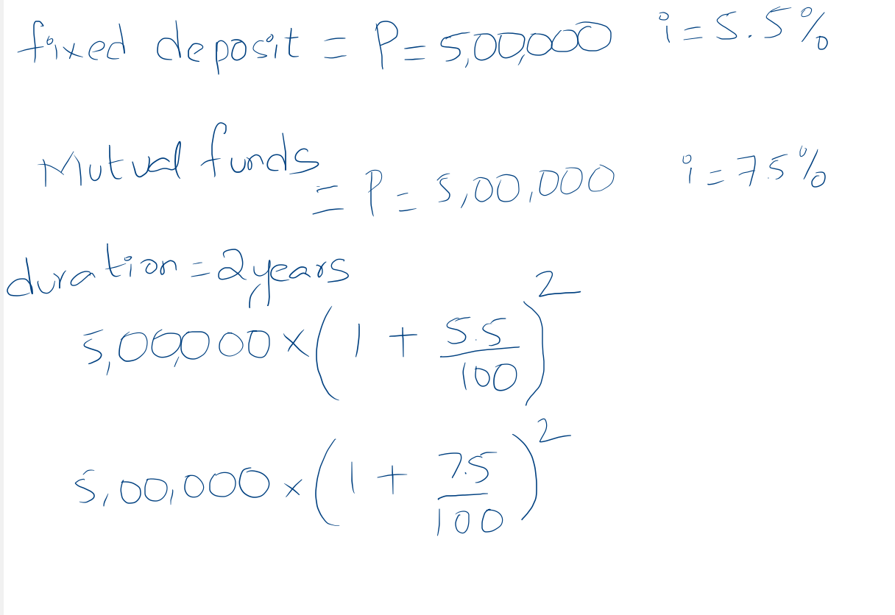
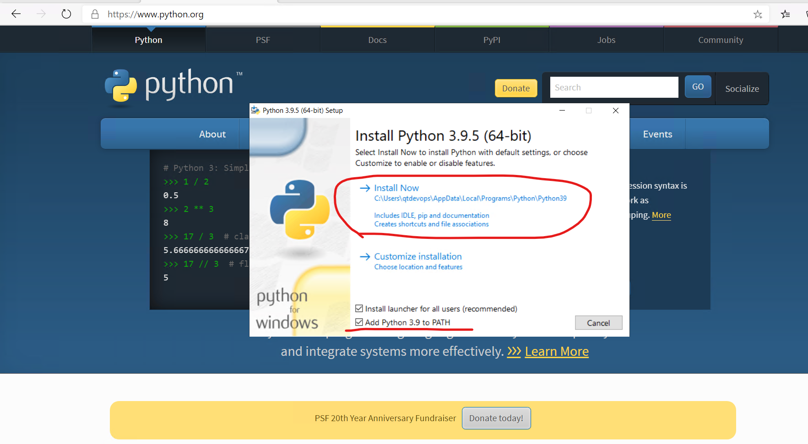
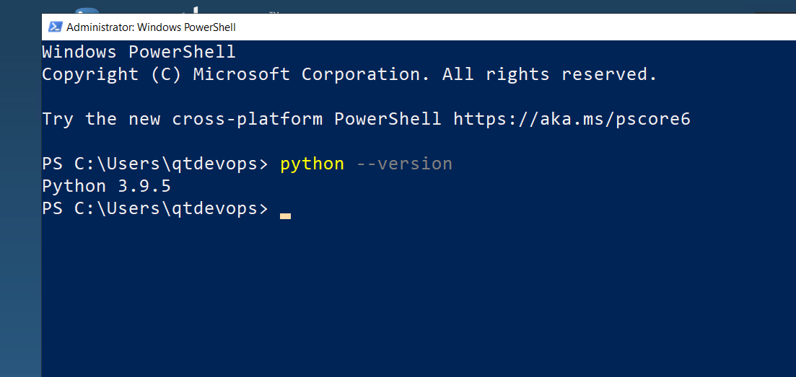
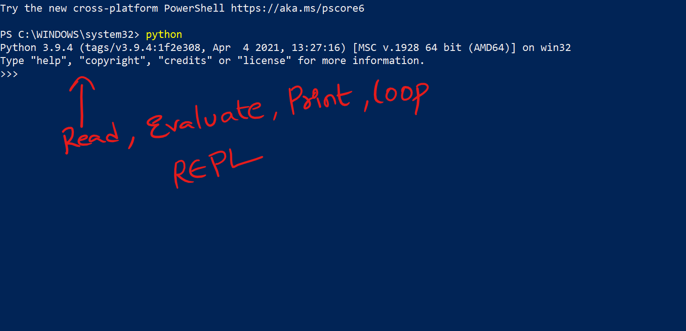
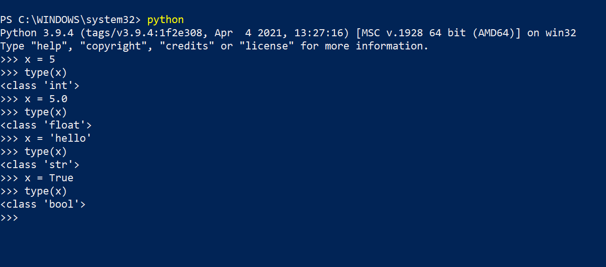
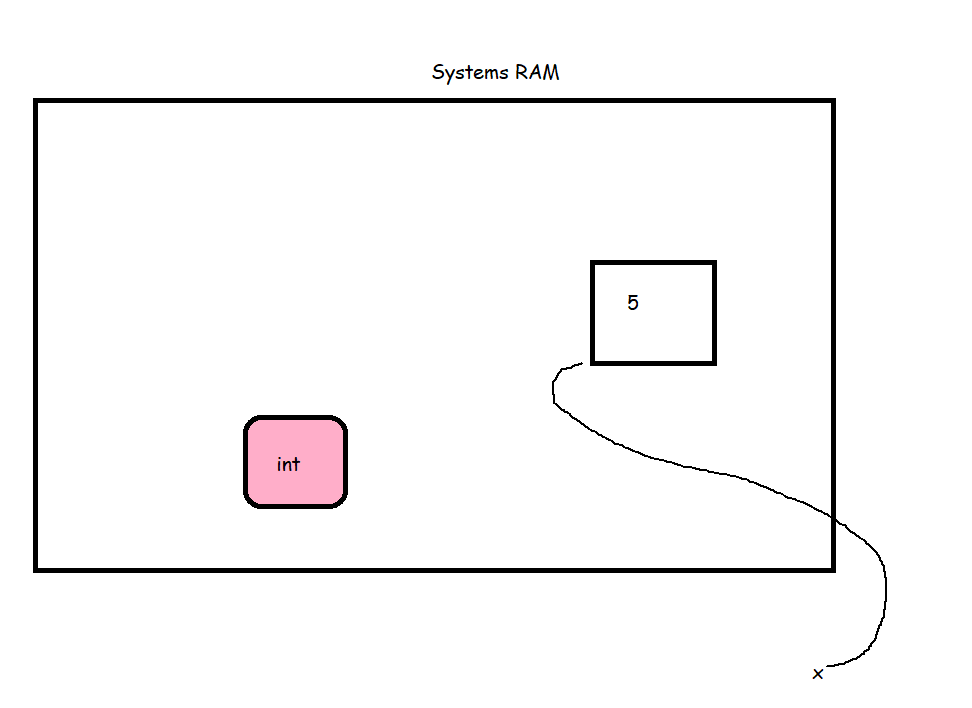
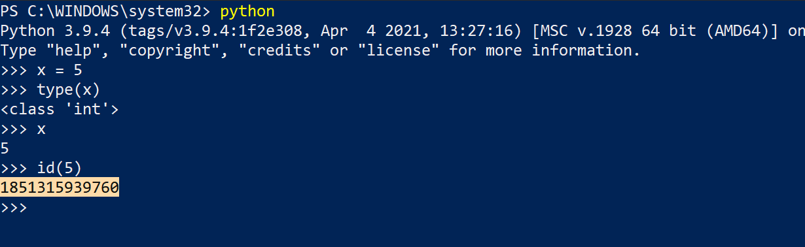

### Requirement 
* I need a calculator which helps in choosing where to invest
  * Fixed Deposits
  * Mutual Funds
* To this calculator I will be providing principal amount and number of years of investment
* Possible Solutions
  * Calculate manually every time using pen & paper
  * Build a Calculator application
* How to Solve this 
  * Know the Calculations
* Calculations:

* To solve this program we need to have some memory from RAM and processing time from CPU
```python
principal = 500000
fd_rate_of_intrest = 5.5
mf_rate_of_intrest = 7.5
period_in_years = 2
fd_after_period = principal * (1+ fd_rate_of_intrest/100)** period_in_years
mf_after_period = principal * (1+ mf_rate_of_intrest/100)** period_in_years

print(f"FD after {period_in_years} years is {fd_after_period}")
print(f"MF after {period_in_years} years is {mf_after_period}")
```

* To install python [Refer Here](https://learningthoughts.academy/2020/02/11/how-to-install-python-on-windows/)


* Mac users install homebrew [Refer Here](https://brew.sh/)

* Install Git and Visual Studio Code:
  * Mac: 
    ```
    brew install git 
    brew install --cask visual-studio-code
    ```
  * Windows: 
  ```
  choco install git -y  
  choco install vscode -y
  ```

* Open interactive Python (REPL)



### Data: Types, Values, Variables and Names
* Lets examine by execute the following in interactive python

* When we need a location in memory we can directly assign values to variable

* A python program is given access to some of your computers memory by operating system. This memory is used for the code of the program and the data it uses. 
* In python memory is basically an object which consists of following information
  * A type that defines what it can do
  * A unique id to distinguish from other objects
  * A value consistent with type
  * A reference count that tracks how often this object


### Next Steps
1. Data Types
2. Mutability
3. Variables & Best practices for variable names
4. Numbers