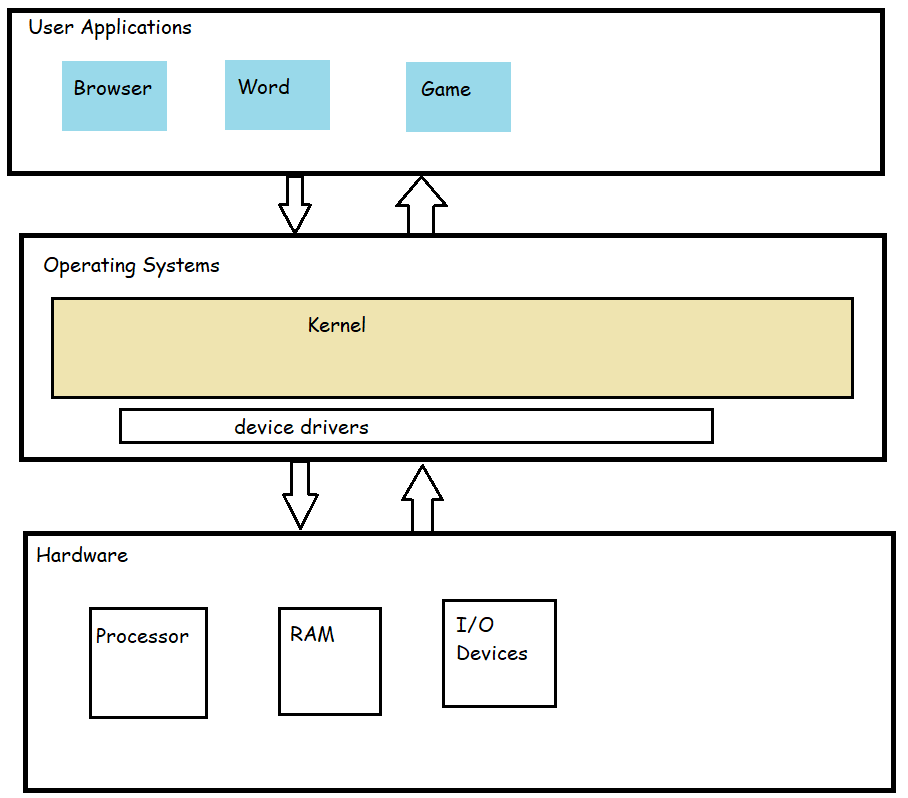
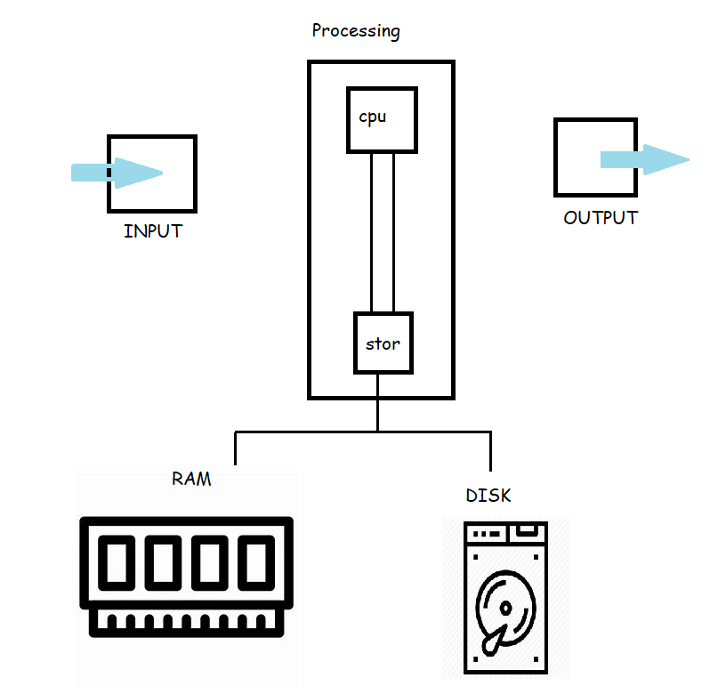
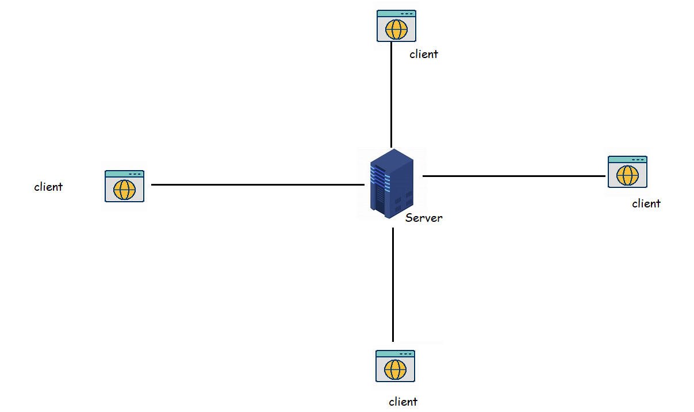
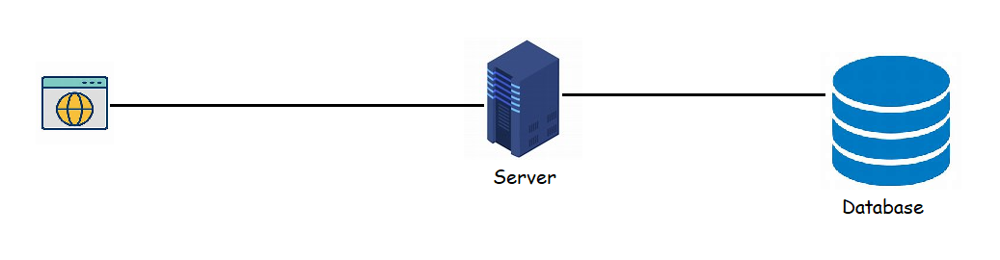
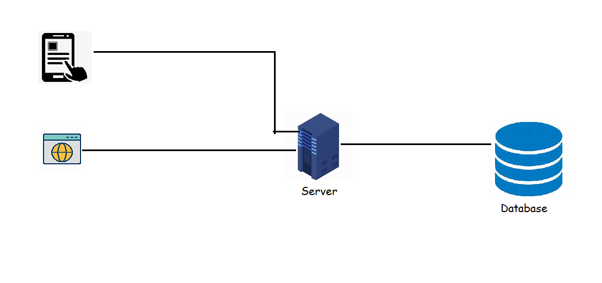
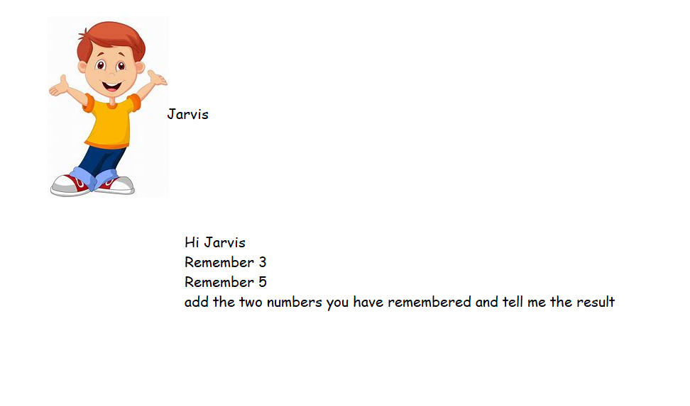

### Program
* Layers of Compute

* How Computer Programs work

* Types of Applications
  * Standalone applications:
    * This is a program that can work offline and it doesn't require a network connection.
  * Client-Server application:
    * Client-Server is a model we can use to create applications that can run on more than one machine
    
  * Web applications:
    * A web application is a special form of client-server application where we have client that interacts with a user in the form of webpage
    
  * Modern web applications
    
  * ML Models
* Computers are dumb.
  * We need to tell computers how to accomplish some task


### Installing necessary Software's on your Laptop
* Windows 10:
  * Installing chocolatey: [Refer Here](https://chocolatey.org/install)
  * Install Python
  ```
  choco install python -y
  choco install git -y
  choco install vscode -y

  ```
* Mac:
  * Install homebrew [Refer Here](https://docs.brew.sh/Installation)
  * Install visual studio code [Refer Here](https://formulae.brew.sh/cask/visual-studio-code)
  * Install python 3.9 [Refer Here](https://formulae.brew.sh/formula/python@3.9)
  * ```brew install git```
* Linux (Ubuntu):
  * Install git ``` sudo apt install git -y```
  * Install python ```sudo apt install python3```
  * Visual studio code [Refer Here](https://code.visualstudio.com/download)
* Create accounts
  * GitHub [Refer Here](https://github.com/join?ref_cta=Sign+up&ref_loc=header+logged+out&ref_page=%2F&source=header-home)
  * HackerRank [Refer Here](https://www.hackerrank.com/auth/signup?h_r=home&h_l=body_middle_left_button&h_v=1)
  