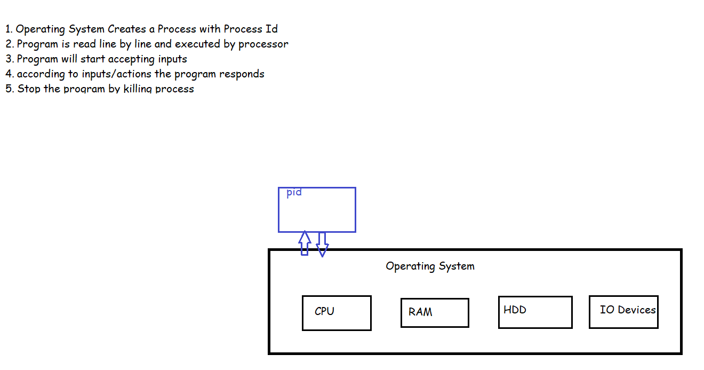
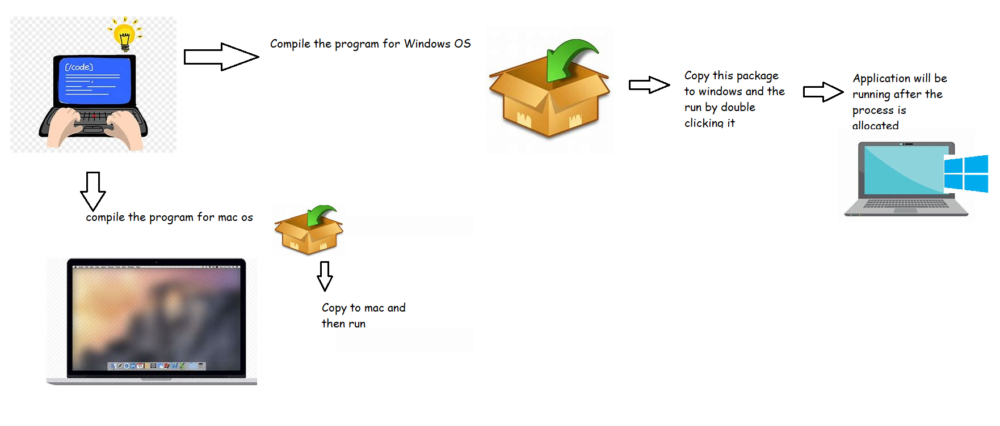
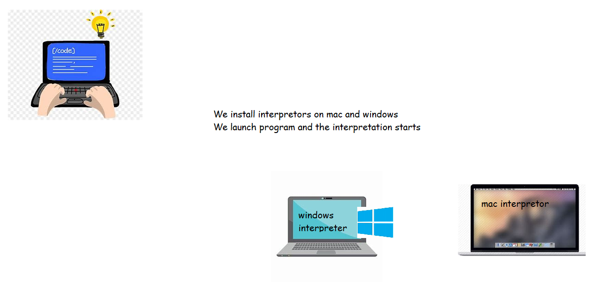
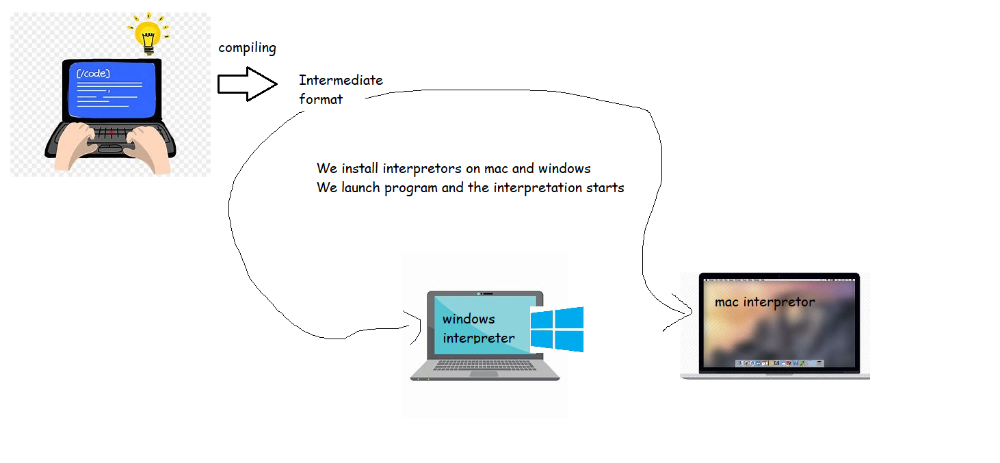
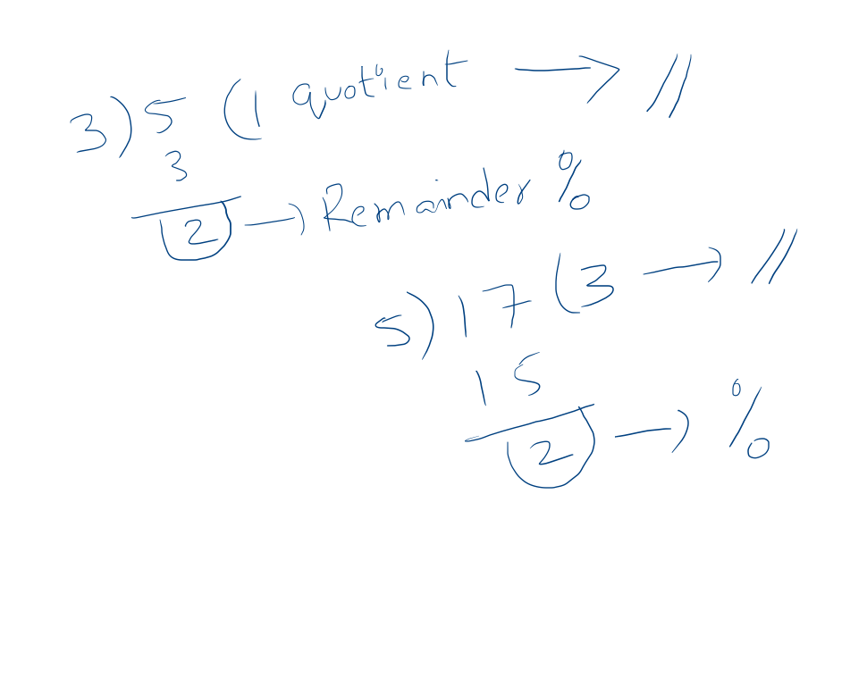
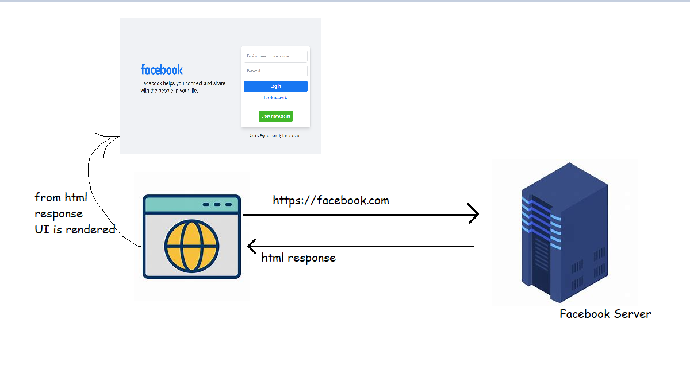

# How Computer programs work
* Overview of Process

* To build an application which does some activity we write programs
  * We can write programs which operating system understands and also understandable by humans
  * This is exactly what programming languages do. Examples are
    * C
    * C++
    * C#
    * Java
    * JavaScript
    * Python
    * Ruby
    * Swift
    * GO
* We need some Software's which convert the programming language into something which your OS understands
  * Compiler: To understand compiling lets look at following example
    * Dubbing is done to make a release of Avengers in Hindi
    
    * Movie is dubbed b4 release 
    * Does the Movie run time increase in Hindi?
    * Compiler also converts the programming language code into some format understandable by OS before the application/program is run
    * Since the conversion is already done application will run on OS directly without taking extra time.
    
  * Interpreter
    * PM has visited Vijayawada and is addressing crowd
    * A Translator will be arranged during the meeting to do translation into Telugu
    * When is Translation done? during the meeting
    * Since translation is happening during speech, it takes a longer time
    * Interpreter converts programming language into some format when the application/program is running
    * Interpreter based applications might be little bit slower during initial runs.
    
  * Compiler + Interpreter:
  

### How to think programmatically
* Lets use this character _Jarvis_ as a reference to Program

* Jarvis is someone whom we use to understand the programming
* Jarvis is dumb and he is extremely good at following instructions. Jarvis knows about
* how to allocate the memory on the RAM
* how to do mathematical operations like ```+ - * / // %```
* Lets understand
* //: integer division
* %

* Consider speaking to Jarvis as speaking to a kid who knows only few things
* Whole idea is how to solve problems by taking help from Jarvis

## Solve Some Problems by taking help from Jarvis 

### Problem 1: Find whether the number is even or odd 
* Lets start speaking with Jarvis
```
Hi Jarvis, Can you help me out
Remember(Store in RAM) input provided by user as input
calculate input%2 and remember as remainder
if remainder is equal to zero say input is even
else say input is odd
```

### Problem 2: Find whether the year entered is leap year or not
* Lets speak with Jarvis
```
Hi Jarvis, Can you help me out
Remember input provided as input
calculate input%4 and remember as modulus4
if modulus4 is equal to zero 
   calculate input%100 and remember as modulus100
   if modulus100 is equal to zero
     calculate input%400 and remember as modulus400
     if modulus400 is equal to zero say input is leap year
     else input is not a leap year
   else 
     say input is leapyear
else
  say input is not a leap year
```

### Web Applications
* Basic Web Application Workflow

* At this moment we have some functionality running on browsers and some functionality running of Facebook server 
* Facebook Server => will implement core functionalities of Facebook 
* On the Browser => Functionality with respect to user interactions will be made available
* Browser can run HTML,CSS,JavaScript
  * Modern Web applications have as much code in frontend as in backend
    * Java Script Frameworks such as Angular, React, Vue Js,
* Where as Servers can be implemented in multiple Languages or frameworks
  * DotNet => Asp.net
  * Java => Spring Boot, JSP
  * Python => Django
  * Ruby => Ruby On Rails 
  * JavaScript => Node JS


