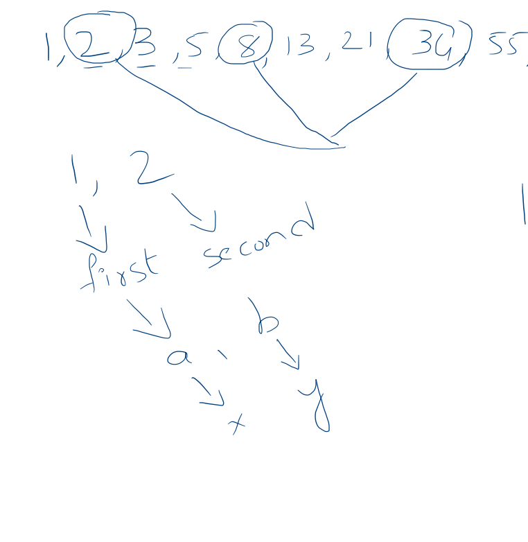
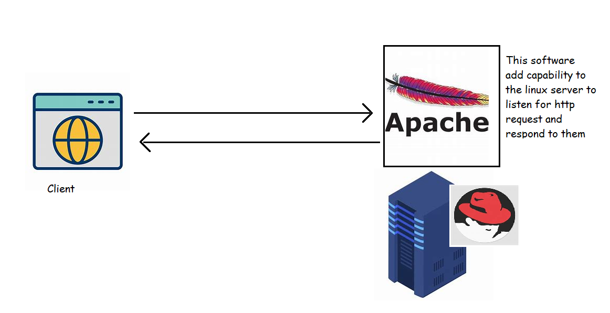

### Thinking programmatically continued
* Jarvis

* Project Euler Problems [Refer Here](https://projecteuler.net/archives)

#### Project Euler problem 1
* For Problem 1 Statement [Refer Here](https://projecteuler.net/problem=1)
* Solution by hand

* Speaking with Jarvis
```
Hi Jarvis, Can you help me out
Remember input from user as max_value
Remember 0 and call it as result
start from index with 1 till max_value or (index < max_value)
   if index%3 is equal to 0 or index%5 is equal to 0
    then add index to the result
   increment index by 1
done
print result
```


#### Project Euler Problem 2
* For Problem 2 Statement [Refer Here](https://projecteuler.net/problem=2)
* Solution by hand

* Speaking with Jarvis
```
Hi Jarvis help me out
Remember 50 as max_value
Remember 1 as first
Remember 2 as second
Remember 2 as result
calculate first+second and remember as third
Repeat the following till third < max_value
   if third%2 is equal to zero
     then add third to result
   assign value of second to first 
   assign value of third to second
   calculate first+second and remember as third
print result
```


#### Project Euler 3
* For problem [Refer Here](https://projecteuler.net/problem=3)
* Lets speak with Jarvis to solve the first half of the problem which is largest factor
```
Hi Jarvis help me out
Take input from user and remember it as value
start with index = value//2 till index > 2
   if value%index == 0 
      then say index is largest factor
      exit
   decrement index by 1
```


#### Web Server
* A webserver is a software that uses HTTP Protocols or other protocols to respond to client request made over the web.
* WebServer responds to client request generally 
  * by sending HTML Pages
  * by sending multimedia content
* Popular Web Servers
  * Apache
  * Nginx
  * IIS (Internet Information System)
* We can install webserver on the Operating Systems, Generally for the production/live usage we use Server Operating Systems
